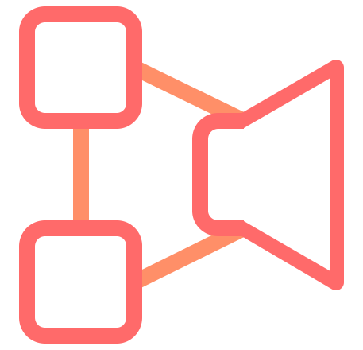

<p align="center">
    
</p>
<h3 align="center">
    state-speech-synth
</h3>
<p align="center">
    
</p>
<p align="center">
    <a href="https://nodei.co/npm/state-speech-synth">
        
    </a>
</p>

---

# Intro
`state-speech-synth` is a lightweight wrapper around the native speech-to-text API ([`speechSynthesis`](https://developer.mozilla.org/en-US/docs/Web/API/SpeechSynthesis)+[`SpeechSynthesisUtterance`](https://developer.mozilla.org/en-US/docs/Web/API/SpeechSynthesisUtterance). It provides a succinct API and the guarantee of consistent  data.

# Why
Tracking the playing state of `speechSynthesis` + `SpeechSynthesisUtterance` can be a headache. There are essentially two paths to take. One is untrustworthy, and the other is cumbersome.
**Inconsistent:** 
`speechSynthesis` has 3 read-only boolean values `speaking`, `paused`, `pending`. In an idea world only one of these is true at a time, unless they are all false in which case the system is idle. It doesn’t take much finagling from the use to cause 2 of these values to be true at the same time leading you to [representing impossible states](https://gist.github.com/busypeoples/ab2f993843f23614232a1f8500a4b542).
Example: [SpeechSynth Native Example - CodeSandbox](https://codesandbox.io/s/30rw79pvvm)

**Cumbersome:**
A solution to the inconsistency issues is use the event handlers on each `SpeechSynthesisUtterance` instance. There is a handler for almost every situation [onend](https://developer.mozilla.org/en-US/docs/Web/API/SpeechSynthesisUtterance/onend) , [onerror](https://developer.mozilla.org/en-US/docs/Web/API/SpeechSynthesisUtterance/onerror),  [onpause](https://developer.mozilla.org/en-US/docs/Web/API/SpeechSynthesisUtterance/onpause) , [onresume](https://developer.mozilla.org/en-US/docs/Web/API/SpeechSynthesisUtterance/onresume) , [onstart](https://developer.mozilla.org/en-US/docs/Web/API/SpeechSynthesisUtterance/onstart). It’s missing an event for the `onqueued` and `onprocessing`, but that’s more of a nitpick. Which I suppose is the crux of the issue. There’s a lot of little things to write. I should know. That’s how this module is written. 

# How It Works
This module wraps `speechSynthesis` + `SpeechSynthesisUtterance` as a single API. It uses the event listeners to accurately track state changes (aren’t you glad you won’t have to write those 😁). Those listeners fire off to a single handler that will validate the state change and pass the result ( a single value ) to a state change handling function you’ve specified via the `onStateChange` subscriber function. 

# Usage
Here are a few examples of the code in action 
**Native JS:** [state-speech-synth Vanilla Example - CodeSandbox](https://codesandbox.io/s/0oxwp76wjn) - compare it to the example above. Not only it is safer, it’s shorter!
**React JS:** [state-speech-synth React Example - CodeSandbox](https://codesandbox.io/s/p2rnn75r2m) - works so well with React Hooks
**Chrome Extension:** [read-to-me/background.js at master · easilyBaffled/read-to-me · GitHub](https://github.com/easilyBaffled/read-to-me/blob/master/background.js) - A Chrome Extension I use to help with my dyslexia 

# API
## `onStateChange( stateChangeHandler )`


Adds  `stateChangeHandler`  to the subscription list. `stateChangeHandler` will then be called every time there is a change in the SpeechSynthesis state. You can add as many handlers as you like. They will be called in the order there were added. `

When called `stateChangeHandlers` are passed 
`currentState (IDLE| PROCESSING|PLAYING|PAUSED)`: - One of the state Symbols exported by the `state-speech-synth` module
`typeString (string)` - the type property from the original `SpeechSynthesisUtterance` event
`event (object)` - the original `SpeechSynthesisUtterance` event
`validTransition (boolean)` - a value indicating of the change from `SpeechSynthsis` was valid. If `false` the `currentValue` will not change, but the event will be the new invalid event.


#### Arguments
`stateChangeHandler (Function)` - A function that will be called whenever state changes

#### Returns
`(Function)` - A function that, when called, will unsubscribe the associated handler.

#### Example 
```js 
synth.onStateChange( ( currentState, type, event, validTransition ) => {
	if ( ! validTransition ) return;

	const displayStates = synthStateMap[currentState];
	
	speechControls.map(
		(controlElement, i) =>
			(controlElement.style.display = getDisplayStyle(displayStates[i]))
	);
});
```

## `speak( text, utteranceConfigObj )`
This function is a combination [`speechSynthesis.speak`](https://developer.mozilla.org/en-US/docs/Web/API/SpeechSynthesis/speak) and [`new SpeechSynthesisUtterance(text)`](https://developer.mozilla.org/en-US/docs/Web/API/SpeechSynthesisUtterance/SpeechSynthesisUtterance). It will handle setting up the utterance instance and firing it off to be processed. 

#### Arguments
`text (string)` - A string that will be added to the queue for processing and speaking
`utteranceConfigObj` - and object that will be used to set the properties of the utterance instance. Currently only `rate (string|number)`, `voice (string)` and `volume (string|number)` are handled.

#### Example
```js
synth.speak(textInput.value, { voice: 'Alex', rate: 1.7 });
```

## `pause`, `resume`, `cancel`
These three functions directly use the `SpeechSynthesis` functions of the same name.
These are all documented on MDN far better than I could here.   
[`pause`]()  
[`resume`]()  
[`cancel`]()

# Roadmap
- [ ] Add `queued` state
- [ ] add `toAudio` conversion
- [ ] have `speak` take an utterance
- [ ] allow additional utterance options
