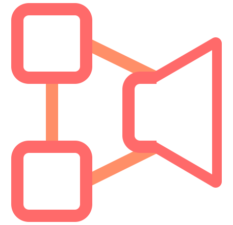

# Work in Progress
<p align="center">
    
</p>
<h3 align="center">
    state-speech-synth
</h3>
<p align="center">
    
</p>
<p align="center">
    <a href="https://nodei.co/npm/state-speech-synth">
        
    </a>
</p>

---

# Intro
WHAT IT DOES

State-Speech-Synth wraps the native Text-to-Speech offering with a small state machine in order to produce a succinct and consistent experience.
SSS provides 
Instead of polling for changes to the `SpeechSynthesis` object and deriving the current state, `state-speech-synth` delivers it with an even hook.  


---

# Why
WHAT PROBLEM IS IT SOLVING

The native SpeechSynthesis & SpeechSynthesisUtterance small APIs belie it's complexity. To identify the current state of the SpeechSynthesis, across all tabs you have to check 3 booleans `paused`, `pending` and `speaking`. Ideally only one of them will be true at a time, or all of them will false. But there are non-corner cases where this isn't true and you can get stuck representing what seems like an impossible state.
Instead of deriving the current state from `paused`, `pending` and `speaking`,  `SSS` will only offer a single state value at a time `PLAYING`, `PAUSED`, `PROCESSING` and `IDLE` . And instead of having to poll the `SpeechSynthesis` or setting event listers and your Utterance objects,  `SSS` offers a `onStateChange` handler where you can all of your work.

**Example**

### Native
### With state-speech-synth

---

# API

## `onStateChange( callBackHandler: function( currentState ): * ): removeHandler`

#### Arguments

#### Returns

#### Example
```js

```

---

## `speak`

#### Arguments

#### Returns

#### Example
```js

```

---


## `pause`, `resume`, `cancel`
These three functions directly use the `SpeechSynthesis` functions of the same name.
These are all documented on MDN far better than I could here.   
[`pause`]()  
[`resume`]()  
[`cancel`]()

#### Example
```js

```

---

## `resume`

#### Example
```js

```

---

## `cancel`

#### Example
```js

```


---
---
---

This is a alternative interface for the current SpeechSynthesis and SpeechSynthesisUtterance models
This sits on top of the native SS and translates the sometimes inconstant state that requires constant checking into a reactive model where you can subscribe to changes with a single function.
The new model offers two parts:
The first is a single function `onStateChange`. This is how you subscribe to the SS and it's changes.
`onStateChange` This takes a function that will be called when the SS's state changes. It returns a function that you can call to remove the passed in `changeHandler`. You can call `onStateChange` as many times as you want to add any number of `changeHandler` to the SS. When the state changes they will each be called and in the order they were added. Removing a `changeHandler` will not alter the remaining order.
There is only one instance of SS (because browsers can only have one sounding off at a time(?)).

The second part are the functions to control the SS state. `speak`, `resume`, `pause`, `cancel`, `configure`.
These replicate the functions available from the native SpeechSynthesis.
The only difference between these and the native is that `speak` takes an optional second argument which will be the configuration for the SSU.
There is also a standalone `configuraiton` function to server that purpose as well. Calling these will trigger changes to SS regardless of `changeHandler`s.
